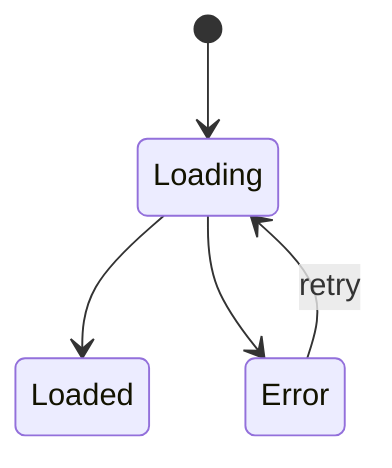

# SPAC Template

Use this template when writing Phase 13. Fill every section from your gathered inputs. If a section is not relevant, write `Not required for this feature.`

---

# SPAC: [Feature Name]

**Status:** 🟡 DRAFT
**Team:** [React Native | Native iOS / Android]
**Author:** [name]
**Reviewer:** TBD
**Last Updated:** [YYYY-MM-DD]
**Confidence:** [0–100]%
**UI Data Mapping Confidence:** [High / Medium / Low / Need to verify]
**Codebase Context:** [Bitbucket MCP connected / Uploaded files / Partial / Not available]
**Codebase Context Confidence:** [High / Medium / Low / Not available]
**Repository:** [workspace/project/repo or N/A]
**Branch:** [branch or N/A]
**Module/Path:** [path or N/A]
**Documentation Context:** [Available / Partial / Not available]
**Documentation Context Confidence:** [High / Medium / Low / Not available]
**Docs Used:** [`CLAUDE.md`, `README.md`, `docs/navigation.md`, etc. or N/A]

---

## 1. Feature Overview

[One paragraph describing what this feature is and what it does for the user.]

---

## 2. Target Users

- **Role:** [e.g. authenticated user, admin, guest]
- **Auth state:** [e.g. logged in, onboarded, subscription active]
- **Platform:** [iOS / Android / both]
- **User type:** [e.g. group leader, member, coach]

---

## 3. Problem Statement

[One sentence: what problem does this feature solve for the user?]

---

## 4. Goals

- [Goal 1]
- [Goal 2]

---

## 5. Out of Scope

- [Item explicitly excluded from this version]
- [Item deferred to a future version]

---

## 6. Entry Points

- [e.g. Tab bar → Profile → Settings]
- [e.g. Push notification tap → deep link]
- [e.g. Dashboard card → CTA button]

---

## 7. User Flow

### Happy Path

Each step must capture: what the user does, what the app does in response, whether a backend service is invoked (and which), and how the result affects the next step or UI state. Do not describe this only as a sequence of screens or taps — a developer must be able to infer end-to-end app behavior, including state changes, from this alone.

1. **User action:** [what the user does] → **App response:** [what happens] → **Backend call:** [service/API invoked, or "none"] → **Effect on next step/state:** [how the result changes what the user sees or can do next]
2. [Step 2, same structure]
3. [Step 3 — success state, same structure]

### Alternative Flows

[Describe any secondary paths, conditional branches, or role-specific variations, using the same user action / app response / backend call / state-effect structure where relevant.]

### State Transitions (optional)

Only for screens with complex state-dependent behavior that the Happy Path and Section 10 — UI States can't describe clearly on their own (e.g. a multi-step flow with several interdependent states). Skip this subsection entirely for simple screens — write `Not required for this screen.`

When needed, add a Mermaid `stateDiagram-v2` block describing the states and transitions:

````md

````

If a diagram-capable MCP tool is connected (draw.io, or Figma's `generate_diagram` as a fallback — it also accepts `stateDiagram-v2` syntax), ask the specialist a single yes/no question before generating anything (e.g. "Want me to render this as a draw.io diagram instead of a Mermaid block?") — never render one unasked. If they decline, or no such tool is connected, keep the Mermaid code block directly in this section — it renders inline in most Markdown viewers — rather than skipping the diagram.

---

## 8. UI Requirements

### Screen: [Screen Name]

[Describe the layout, visible elements, actions, and any conditional visibility rules.]

**Every interactive/clickable element must state exactly what happens when it's activated** — the navigation target, the API call triggered, the state change, the modal opened, etc. Never describe an element only by its type (e.g. "button"); say what pressing it actually does. If the behavior is unknown, mark that specific element with the TBD format below rather than omitting it.

> ⚠️ TBD: [Use this format for any unknown or unconfirmed requirement — including an interactive element whose click/activation behavior isn't known yet.]

> Assumption: [Use this format for any assumption made in absence of confirmation. Also add this same assumption as a line item in Section 20 — Assumptions, so it's never only implied here.]

---

## 9. UI Element Data Mapping

For every mapped element, verify whether the API value can be displayed directly or needs transformation first — code-to-label conversion, lookup-table resolution, formatting, concatenation, calculation, localization, unit conversion, sorting, or filtering. Do not assume a backend code has the same meaning or representation as the user-facing value; note any such transformation in the Notes column. If it isn't documented, mark it `Need to verify` there instead of assuming a 1:1 mapping.

### Screen: [Screen Name]

| UI Element | Element Type | Screen / Frame | Display Rule | Data Source | Backend/API Field | Fallback / Empty Value | Confidence | Notes |
|---|---|---|---|---|---|---|---|---|
| [Element name] | [Text/Button/Image/Badge/etc.] | [Frame name] | [Always visible / condition] | [Service/API/Static/Local state/Derived] | [field.path or N/A] | [fallback or hide] | [High/Medium/Low/Need to verify] | [notes — including any transformation/mapping logic needed to go from the raw API value to the displayed value] |

---

## 10. UI States

### Loading State

[Describe what the user sees while data is loading — skeleton, spinner, disabled interactions.]

### Empty State

[Describe what the user sees when there is no data.]

### Error State

Describe the *functional* application behavior, not only the displayed error message. For each relevant error case (API failure, network error, validation error, permission denied, session expired, partial-failure), cover:

- Whether existing data/state is preserved or cleared
- Whether the user can retry, and what exactly is retried (the whole action, just the failed call, etc.)
- Whether navigation is blocked while the error is showing
- Whether different error responses require different behavior (e.g. permission-denied vs. validation vs. network timeout)

Do not invent error-handling behavior that isn't supported by the available sources — mark `TBD`/`Need to verify` instead.

### Success State

[Describe what the user sees or experiences after a successful action.]

### Disabled State

[Describe any elements that can appear in a disabled state and the condition that triggers it.]

---

## 11. Data & Backend Dependencies

For every backend dependency, describe not only what data it provides, but when it's invoked, what request data is sent, which response data is consumed, and how the app processes the response — including any parsing/mapping logic (e.g. resolving codes to labels, building a tree from a flat list). This is where non-trivial response-handling logic belongs — don't leave it implied by the UI description alone.

| Service / API | Endpoint | Method | When Invoked | Request Data | Response Data Consumed | Response Processing | Purpose | Contract Source |
|---|---|---|---|---|---|---|---|---|
| [Service name] | [/path/to/endpoint] | [GET/POST/etc.] | [on screen load / on user action / polling / etc.] | [key request fields] | [key response fields used] | [parsing/mapping logic, or "used as-is"] | [what it does] | [Backend DD / TBD] |

> ⚠️ TBD: [Use for unknown endpoints.]

> ⚠️ For every backend-driven UI element, verify whether the API value can be displayed directly or requires transformation before presentation (code-to-label conversion, lookup-table resolution, formatting, concatenation, calculation, localization, unit conversion, sorting, filtering, or other derived display logic). Do not assume a backend code has the same meaning or representation as the user-facing value. If the transformation isn't documented, mark it `Need to verify`.

> ⚠️ For every collection or list returned by the backend, consider boundary and volume behavior: the expected behavior for an empty collection, a single item, and a large number of items, and — where relevant — pagination, scrolling, result limits, truncation, "show more", search/filter behavior, sorting, and performance-related constraints. Do not invent limits or pagination behavior; mark it `TBD` / Open Question if it can't be determined from Figma, requirements, API documentation, or the existing implementation.

---

## 12. Validation Rules

| Field | Rule | Error Message |
|---|---|---|
| [Field name] | [e.g. Required, max 100 chars] | [User-facing error text or i18n key] |

---

## 13. Permissions

| Permission | Required | Behavior if denied |
|---|---|---|
| [e.g. Push notifications] | [Yes / No] | [e.g. Show permission prompt / fallback] |

---

## 14. Security & Privacy

[Describe who can see the data, what should be masked or hidden, permission-denied behavior, and any audit/privacy expectations. If not required, write: `Not required for this feature.`]

---

## 15. Accessibility

[Describe screen reader labels, icon-only button labels, dynamic font size support, color contrast expectations, and accessible error/loading states. If not required, write: `Not required for this feature.`]

---

## 16. Localization & RTL

[Describe language support, i18n usage, RTL layout requirements, directional icon behavior, and date/time formatting. If not required, write: `Not required for this feature.`]

---

## 17. Analytics / Tracking

[Describe tracked events and properties. If not required, write: `Not required for this feature.`]

```md
### Event: [event_name]

Triggered when:
- [condition]

Properties:
- [property]: [value or source]
```

---

## 18. Platform Notes

[Describe any iOS vs Android behavioral differences. Use subsections if needed:]

#### iOS

[iOS-specific behavior.]

#### Android

[Android-specific behavior.]

---

## 19. Project Context Used

### Repository Context

- Repository: [workspace/project/repo or N/A]
- Branch: [branch or N/A]
- Module/path: [path or N/A]
- Bitbucket MCP status: [Connected / Failed / Not configured]

### Documentation Context

Docs inspected:
- [`CLAUDE.md`] — [why it mattered]
- [`README.md`] — [why it mattered]

Relevant project rules:
- [Rule or convention that affects this SPAC]

### Codebase Context

Relevant areas inspected:
- `[path]` — [why it mattered]

Codebase context notes:
- Detailed code scan findings were surfaced in chat only.
- This SPAC reflects reusable patterns but does not prescribe low-level implementation.

---

## 20. Assumptions

List every assumption made anywhere in this document — including small UI/behavior judgment calls (hidden/removed elements, disabled actions, defaults, fallback behavior) — not only ones judged significant.

- [Assumption that affects user behavior]
- [Assumption about backend/API availability]
- [UI judgment call made without explicit confirmation, e.g. an element hidden/disabled/defaulted for a specific case]

---

## 21. Open Questions

- [Question that must be answered before SPAC can be marked READY]
- [Conflict between Figma and requirements]
- [Unknown data mapping that needs verification]

---

## 22. Developer Handoff Checklist

- [ ] Feature goal is clear
- [ ] Target user is defined
- [ ] Entry point is defined
- [ ] Happy path is defined
- [ ] Bitbucket repository reference is documented
- [ ] Target branch is documented
- [ ] Relevant module/path is documented
- [ ] Bitbucket MCP connectivity was checked
- [ ] Codebase context was used or marked as unavailable
- [ ] Repository documentation was checked when available
- [ ] `CLAUDE.md` was checked when available
- [ ] Relevant feature docs/specs/DDs were checked when available
- [ ] Documentation conflicts are listed in Open Questions
- [ ] UI Element Data Mapping is included for every data-driven screen
- [ ] Each visible dynamic element has a data source or is marked `Need to verify`
- [ ] Unknown data mappings are listed in Open Questions
- [ ] Static text is marked as `Static / i18n`
- [ ] Fallback behavior is defined for missing/null values
- [ ] Empty state is defined
- [ ] Loading state is defined
- [ ] Error states are defined
- [ ] Permissions are defined
- [ ] Security/privacy behavior is defined or marked as not required
- [ ] Accessibility behavior is defined or marked as not required
- [ ] Localization/RTL behavior is defined or marked as not required
- [ ] Backend/API dependencies are defined or marked as TBD
- [ ] Every critical backend dependency has a real contract (IDD/OpenAPI/other API doc/full request-response) or is listed in Open Questions blocking READY
- [ ] Every interactive element in UI Requirements states its click/activation behavior, or is marked TBD
- [ ] Figma frames/components are referenced or marked as not provided
- [ ] Screenshots are referenced if Figma was not available
- [ ] Analytics/tracking is confirmed as required or not required
- [ ] Every assumption (including UI judgment calls like hidden/disabled elements) is listed in Section 20 — none left implicit
- [ ] Open questions are listed
- [ ] Coverage was verified against all in-scope source material (every relevant screen, interactive element, UI state, user action, backend dependency, and business rule is represented or explicitly out of scope)

---

## 23. Downstream AI Usage

This SPAC is intended to be used as input for:

1. Frontend Technical DD
   Expected file:
   - `dd_<feature_name>.md`

2. Development task breakdown
   Expected file:
   - `tasks_<feature_name>.md`

3. Claude Code implementation planning
   Expected usage:
   - Claude Code should read this SPAC together with the Frontend Technical DD and task list before implementation.

4. QA test case generation
   Expected file:
   - `qa_<feature_name>_test_cases.md`
